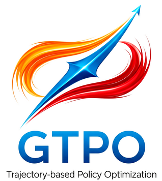
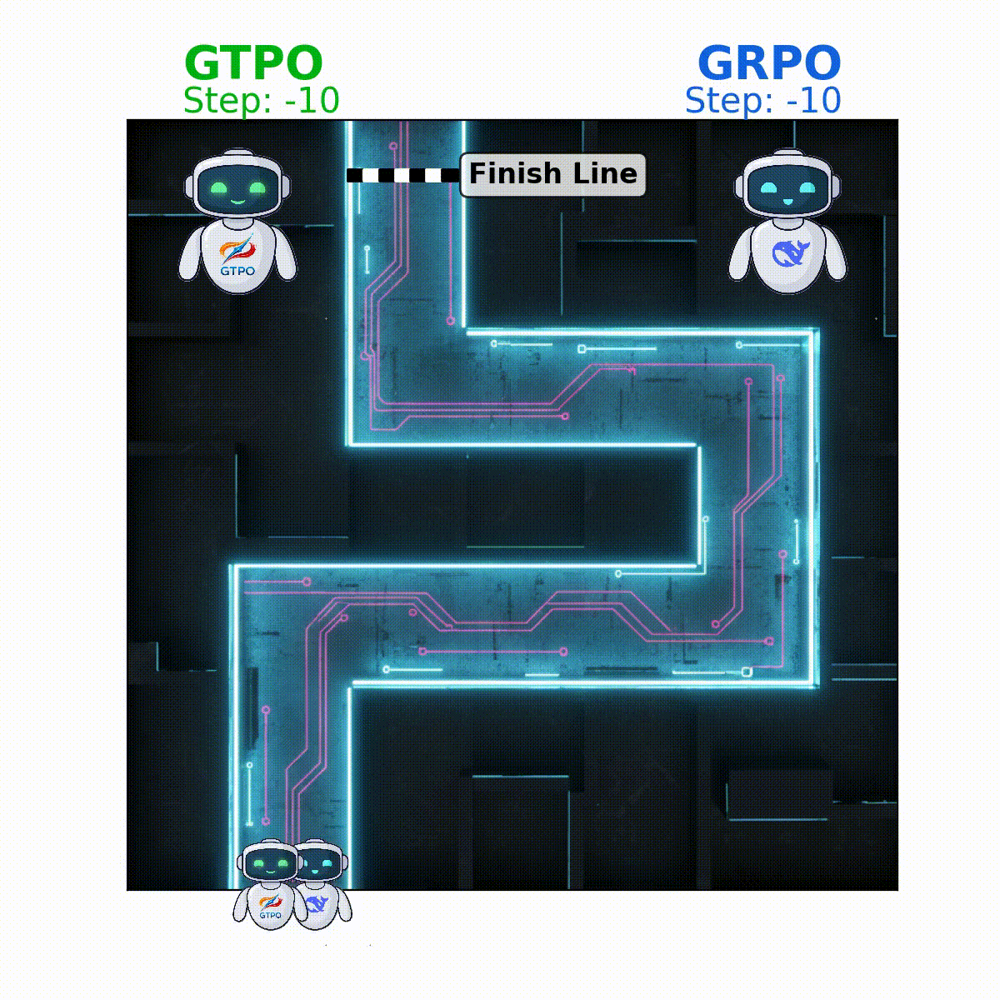
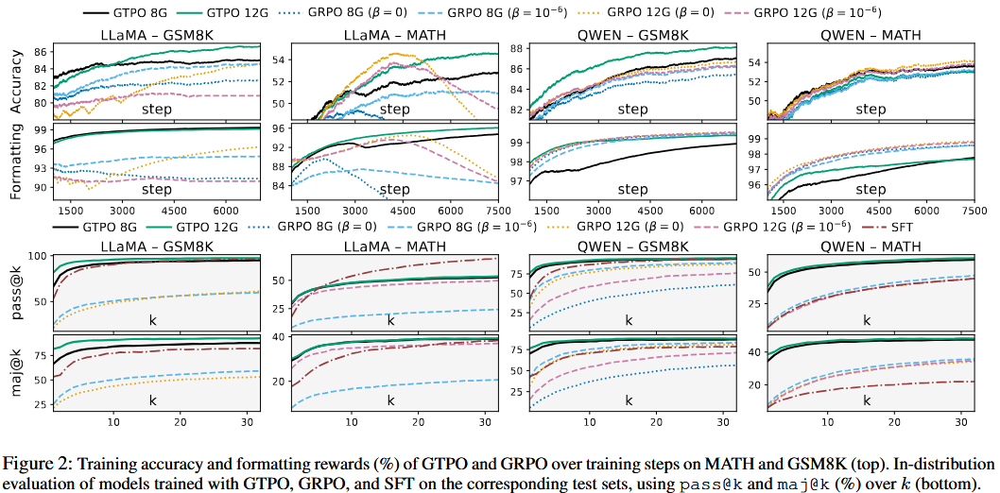
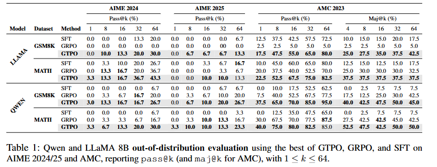
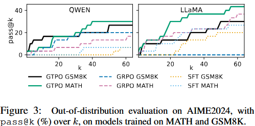
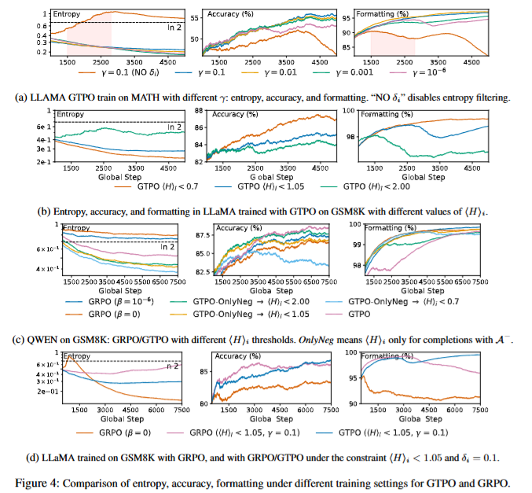

# GTPO: Trajectory-Based Policy Optimization in Large Language Models

[](https://arxiv.org/abs/2508.03772)
[](https://arxiv.org/pdf/2508.03772.pdf)
[](LICENSE)
[](https://www.python.org/)
[](https://colab.research.google.com/github/winstonsmith1897/GTPO/blob/main/colab/GTPO_training_example.ipynb)
[](https://unsloth.ai)

<p align="center">
  
  
</p>


This repository contains the official implementation of **GTPO (Group-relative Trajectory-based Policy Optimization)**, a novel method for stable and effective policy optimization in Large Language Models (LLMs).  
GTPO addresses key limitations of Group-relative Policy Optimization (GRPO), namely:

1. **Token-level gradient conflicts** – where tokens shared across positively and negatively rewarded completions are inconsistently updated, often penalizing essential formatting tokens.
2. **Policy collapse** – where negatively rewarded completions destabilize training, flattening the output distribution and degrading performance.

GTPO introduces **conflict-aware gradient corrections** and **entropy-based regularization** to mitigate these issues, ensuring more stable training without the need for KL-divergence regularization or a reference model.

📄 Paper: [GTPO: Trajectory-Based Policy Optimization in Large Language Models](https://arxiv.org/abs/2508.03772)  
*(Marco Simoni\*, Aleksandar Fontana\*, Giulio Rossolini, Andrea Saracino)*  

\* Equal contribution


---

## 🚀 Key Contributions

- **Conflict-Aware Gradient Correction**  
  Identifies and protects conflict tokens (appearing in both positively and negatively rewarded completions), preventing harmful penalization while reinforcing beneficial updates.

- **Entropy-Based Policy Regularization**  
  Filters unstable, high-entropy completions and introduces entropy-based penalties to prevent policy collapse and stabilize training.

- **No Reference Model Required**  
  Unlike GRPO, GTPO removes the dependency on KL divergence and external reference policies, reducing computational overhead.

- **Empirical Validation**  
  Extensive experiments on **GSM8K**, **MATH**, **AIME 2024**, **AIME 2025** and **AMC** benchmarks using **LLaMA-8B** and **Qwen 2.5-3B** demonstrate:
  - More stable training dynamics  
  - Improved reasoning accuracy  
  - Stronger out-of-distribution generalization  

---

## 📊 Results

- GTPO consistently outperforms GRPO and SFT in **accuracy**, **formatting consistency**, and **pass@k/maj@k metrics**.  
- Demonstrates robustness against policy collapse, maintaining performance across long training runs.  
- Out-of-distribution evaluation on **AIME 2024**, **AIME 2025** and **AMC** shows significant improvements in reasoning generalization.  






---

## ⚙️ Installation

Clone the repository:

```bash
git clone https://github.com/winstonsmith1897/GTPO.git
cd GTPO
````

Install dependencies:

```bash
pip install -r requirements.txt
```

# Try GTPO on Colab

You can run our demo notebook directly in Google Colab:

[](https://colab.research.google.com/github/winstonsmith1897/GTPO/blob/main/colab/GTPO_training_example.ipynb)

# GTPO Training Guide

This guide explains how to train with **`train_model.py`** using a YAML configuration file and **command-line overrides** for quick experimentation. 

---

## 📦 What’s in this repo

- **`train_model.py`** – single entrypoint that:
  - loads **model**, **dataset**, **trainer**, **rewards**, and **training args** from a YAML file;
  - allows **CLI overrides** for model and dataset (and a few extras);
  - patches Unsloth RL, launches training, and saves **LoRA adapters**.
- **`config.yaml`** – your configurable training recipe (model, dataset, training, trainer, GTPO runtime knobs).

---

## ⚡ Quick Start

```bash
python train_model.py config.yaml
```

This will read **everything** from `config.yaml` and start training.

If you want to override the model and dataset **from the CLI**:

```bash
python train_model.py config.yaml \
  --model-name "meta-llama/meta-Llama-3.1-8B-Instruct" \
  --dataset-name hendrycks_math
```

> CLI overrides always take precedence over values in the YAML.

---

## 🧩 Files & Flow

1. **Patch RL** with Unsloth (`PatchFastRL("GRPO", FastLanguageModel)`).
2. **Load model & tokenizer** with LoRA settings from YAML `model` section.
3. **Load & format dataset** from YAML `dataset` section (GSM8K or Hendrycks MATH).
4. **Apply GTPO runtime overrides** (entropy knobs, PAD_ID, torch.compile options).
5. **Build GRPO/GTPO arguments** from YAML `training` section.
6. **Import trainer & rewards** from dotted paths in YAML `trainer` section.
7. **Train** and save LoRA adapters into a descriptive `output_dir` built from config fields.

---

## 🧾 YAML Schema (minimal reference)

```yaml
run_name: "GTPO_LLAMA8B_MATH"

env:
  CUDA_VISIBLE_DEVICES: "0"

model:
  model_name: "meta-llama/meta-Llama-3.1-8B-Instruct"
  max_seq_length: 5500
  max_prompt_length: 4000        # (informational; see training.max_prompt_length)
  lora_rank: 128
  load_in_4bit: true
  gpu_memory_utilization: 0.4
  target_modules: ["q_proj","k_proj","v_proj","o_proj","gate_proj","up_proj","down_proj"]
  random_seed: 3407

dataset:
  name: "hendrycks_math"         # "hendrycks_math" | "gsm8k"
  subsets:                        # for hendrycks_math
    - "algebra"
    - "geometry"
    - "counting_and_probability"
    - "number_theory"
    - "intermediate_algebra"
    - "prealgebra"
    - "precalculus"
  # For GSM8K you would use:
  # name: "gsm8k"
  # subset: "main"
  # split: "train"
  system_instruction: >
    You are a helpful assistant for solving math problems.
    Given a question, first think step by step between <reasoning> and </reasoning>.
    Then, give the final answer between <answer> and </answer>.

training:
  max_prompt_length: 4000         # used to filter prompts & compute max completion length
  warmup_ratio: 0.005
  learning_rate: 1e-6
  adam_beta1: 0.999999
  adam_beta2: 0.999999
  weight_decay: 0.1
  beta: 0.0
  lr_scheduler_type: "cosine"
  optimizer: "paged_adamw_8bit"
  logging_steps: 1
  per_device_train_batch_size: 1
  gradient_accumulation_steps: 1
  num_generations: "8"            # supports "8/12" -> picks the first number
  num_train_epochs: 1
  num_iterations: 1               # informational (not used by TRL directly)
  save_steps: 500
  max_grad_norm: 0.1
  report_to: ["wandb"]

trainer:
  class_path: "gtpo.gtpo_training.UnslothGTPOTrainer"
  reward_funcs:
    - "reward_math.final_reward"

gtpo_runtime:
  ent_threshold: 0.7
  ent_scale: 0.1
  w_raw: 2.0
  pad_id: 128004
  eps: 1.0e-6
  torch_compile_options:
    epilogue_fusion: true
    max_autotune: false
    shape_padding: true
    "trace.enabled": false
    "triton.cudagraphs": false
```

### Notes on keys
- **`training.max_prompt_length`** is the value used to filter prompts and compute `max_completion_length = model.max_seq_length - training.max_prompt_length`.
- Keep `training.max_prompt_length <= model.max_prompt_length <= model.max_seq_length` to avoid truncation or OOMs.
- **`trainer.class_path`** and **`trainer.reward_funcs`** are **dotted paths** importable from Python (dynamic imports).
- **`gtpo_runtime`** overrides attributes in `gtpo.gtpo_training` at runtime (e.g., `ENT_THRESHOLD`, `PAD_ID`, etc.).

---

## 🏋️ Training

Example training script with **GTPO**:

```bash
python train_model.py config.yaml \
  --model-name "meta-llama/meta-Llama-3.1-8B-Instruct" \
  --dataset-name hendrycks_math \
  --run-name "GTPO_Llama8B_MATH_run"
```

Options (CLI overrides supported by `train_model.py`):

* `--model-name` : Override the base model (e.g., `Qwen/Qwen2.5-3B-Instruct`).
* `--dataset-name` : Choose dataset (`gsm8k` | `hendrycks_math` | `math` alias).
* `--dataset-subset` : For **MATH**, repeat flag to provide multiple subsets (e.g., `--dataset-subset algebra --dataset-subset geometry`). For **GSM8K**, the first value becomes `dataset.subset` (default `main`).
* `--dataset-split` : Choose split (`train`, `validation`, `test`), mainly for GSM8K.
* `--cuda` : Override `CUDA_VISIBLE_DEVICES` (e.g., `--cuda 0`).
* `--run-name` : Override `run_name` used in the output directory prefix.

---

## 🍱 Dataset Recipes

### GSM8K (main split)

```bash
python train_model.py config.yaml \
  --dataset.name gsm8k \
  --dataset.split train \
  --run_name GTPO_Llama8B_GSM8K
```

GSM8K answer extraction prefers the final line after `####`; otherwise tries `###` or the last token as a fallback.

### Hendrycks MATH (all standard subsets)

```bash
python train_model.py config.yaml \
  --dataset.name hendrycks_math \
  --run_name GTPO_Llama8B_MATH_ALL
```

### Hendrycks MATH (specific subsets only)

```bash
python train_model.py config.yaml \
  --dataset.name hendrycks_math \
  --dataset.subsets algebra geometry number_theory \
  --run_name GTPO_Llama8B_MATH_AGN
```

> Internally, the script concatenates the selected subsets and then filters examples whose prompt tokenization would exceed `training.max_prompt_length`.

---

## 🔧 Trainer & Rewards

Both are dynamically imported from **dotted paths**:

```yaml
trainer:
  class_path: "gtpo.gtpo_training.UnslothGTPOTrainer"
  reward_funcs:
    - "reward_math.final_reward"
```

Swap to a different trainer or add multiple rewards by listing more import paths:

```yaml
trainer:
  class_path: "custom_trainer.original.UnslothGRPOTrainer"
  reward_funcs:
    - "reward_math.scaled_adaptive_reward_func"
    - "reward_math.formatting_penalty"
```

> The script builds a list of callables from `reward_funcs` and passes them to the trainer.

---

## 🎚️ GTPO Runtime Knobs

Under `gtpo_runtime`, you can change module-level constants in `gtpo.gtpo_training` **at runtime**:

- `ent_threshold` → `ENT_THRESHOLD`
- `ent_scale` → `ENT_SCALE`
- `w_raw` → `W_RAW`
- `pad_id` → `PAD_ID` (⚠️ should typically match your tokenizer’s pad token id)
- `eps` → `EPS`

You can also pass **`torch_compile_options`** that your GTPO internals (e.g., `selective_log_softmax`) will pick up:

```yaml
gtpo_runtime:
  torch_compile_options:
    epilogue_fusion: true
    "triton.cudagraphs": false
    "trace.enabled": false
```

> If a key exists in the target module, the script casts the value to the current type when possible and prints what it set (e.g., `[GTPO] Set ENT_THRESHOLD = 0.7`).

---


## 🧪 More Example Commands

### 1) Full default from YAML
```bash
python train_model.py config.yaml
````

### 2) Change GPU and run name

```bash
python train_model.py config.yaml \
  --env.CUDA_VISIBLE_DEVICES 0 \
  --run_name GTPO_Llama8B_GPU0
```

### 3) Swap base model to Qwen

```bash
python train_model.py config.yaml \
  --model.model_name Qwen/Qwen2.5-3B-Instruct \
  --dataset.name gsm8k \
  --run_name GTPO_Qwen3B_GSM8K
```

### 4) GSM8K with subset override

```bash
python train_model.py config.yaml \
  --dataset.name gsm8k \
  --dataset.subset main \
  --dataset.split train \
  --run_name GTPO_Llama8B_GSM8K_main
```

### 5) MATH with a small subset for quick debugging

```bash
python train_model.py config.yaml \
  --dataset.name hendrycks_math \
  --dataset.subsets prealgebra \
  --run_name GTPO_Llama8B_MATH_prealgebra_debug
```

### 6) Keep YAML but experiment with different CUDA device

```bash
python train_model.py config.yaml --env.CUDA_VISIBLE_DEVICES 5
```

### 7) Combine multiple overrides

```bash
python train_model.py config.yaml \
  --model.model_name meta-llama/meta-Llama-3.1-8B-Instruct \
  --dataset.name gsm8k \
  --dataset.split train \
  --env.CUDA_VISIBLE_DEVICES 3 \
  --run_name GTPO_LLAMA8B_GSM8K_cuda3
```

### 8) Faster warmup & different optimizer

```bash
python train_model.py config.yaml \
  --training.warmup_ratio 0.01 \
  --training.optimizer adamw_torch \
  --run_name GTPO_Llama8B_fastwarmup
```

### 9) Increase generations and sequence length

```bash
python train_model.py config.yaml \
  --training.num_generations 16 \
  --model.max_seq_length 8192 \
  --run_name GTPO_Llama8B_longseq
```

### 🔟 Override GTPO runtime knobs

```bash
python train_model.py config.yaml \
  --gtpo_runtime.ent_threshold 0.8 \
  --gtpo_runtime.ent_scale 0.2 \
  --gtpo_runtime.pad_id 0 \
  --run_name GTPO_Llama8B_runtimeTweaks
```

---

## 🎛 Cheat Sheet of Common Overrides

| Section          | Example Flag                                                 | Description                                  |
| ---------------- | ------------------------------------------------------------ | -------------------------------------------- |
| **General**      | `--run_name EXPERIMENT_X`                                    | Set run/experiment name                      |
| **Environment**  | `--env.CUDA_VISIBLE_DEVICES 1`                               | Choose which GPU to use                      |
| **Model**        | `--model.model_name Qwen/Qwen2.5-3B-Instruct`                | Change base model                            |
|                  | `--model.max_seq_length 8192`                                | Max sequence length                          |
|                  | `--model.max_prompt_length 4000`                             | Max prompt length                            |
|                  | `--model.load_in_4bit false`                                 | Enable/disable 4-bit quantization            |
|                  | `--model.lora_rank 128`                                      | LoRA rank                                    |
|                  | `--model.target_modules q_proj v_proj o_proj`                | LoRA target modules                          |
| **Dataset**      | `--dataset.name gsm8k`                                       | Switch dataset (gsm8k / hendrycks\_math)     |
|                  | `--dataset.subset main`                                      | Single subset (GSM8K)                        |
|                  | `--dataset.subsets algebra geometry`                         | Multiple subsets (MATH)                      |
|                  | `--dataset.split train`                                      | Choose dataset split                         |
| **Training**     | `--training.learning_rate 2e-6`                              | Learning rate                                |
|                  | `--training.warmup_ratio 0.01`                               | Warmup ratio                                 |
|                  | `--training.optimizer adamw_torch`                           | Optimizer choice                             |
|                  | `--training.num_generations 16`                              | Number of generations per sample             |
|                  | `--training.num_train_epochs 3`                              | Number of epochs                             |
|                  | `--training.per_device_train_batch_size 2`                   | Per-device batch size                        |
|                  | `--training.gradient_accumulation_steps 4`                   | Gradient accumulation                        |
|                  | `--training.save_steps 200`                                  | Save checkpoint frequency                    |
|                  | `--training.report_to wandb`                                 | Reporting backend (e.g., wandb, tensorboard) |
| **Trainer**      | `--trainer.class_path gtpo.gtpo_training.UnslothGTPOTrainer` | Trainer class                                |
|                  | `--trainer.reward_funcs reward_math.final_reward`            | Reward functions                             |
| **GTPO Runtime** | `--gtpo_runtime.ent_threshold 0.7`                           | Entropy threshold                            |
|                  | `--gtpo_runtime.ent_scale 0.1`                               | Entropy scaling factor                       |
|                  | `--gtpo_runtime.w_raw 2.0`                                   | Weight for raw reward                        |
|                  | `--gtpo_runtime.pad_id 128004`                               | Padding token ID                             |
|                  | `--gtpo_runtime.eps 1e-6`                                    | Small epsilon for numerical stability        |
|                  | `--gtpo_runtime.torch_compile_options.epilogue_fusion true`  | Torch compile option                         |


---

## 🗂️ Outputs & Logging

- Checkpoints (LoRA adapters) are saved to `output_dir` built from:
  - `run_name`, `adam_*`, `weight_decay`, `num_generations`, `gradient_accumulation_steps`, `warmup_ratio`, `max_seq_length`, `learning_rate`, and `beta`.
- With `report_to: ["wandb"]`, training logs are reported to Weights & Biases (ensure your environment is logged in to `wandb`).
- `save_steps` controls how frequently the model is saved during training.

---

## 🧠 Reproducibility

- Set `model.random_seed` (and optionally your CUDA deterministic flags) to stabilize runs.
- Tokenization-based filtering depends on `training.max_prompt_length` and the **tokenizer**—changing models may change how many examples survive the filter.


## ✅ TL;DR

- Put your recipe in `config.yaml`.
- Run `python train_model.py config.yaml`.
- Add CLI flags (`--model-name`, `--dataset-name`, `--dataset-subset`, `--cuda`, `--run-name`) to iterate faster.
- LoRA adapters are saved under a descriptive `output_dir`.

Happy training! 🧪🚀


## 📖 Citation

If you use this code, please cite our paper:

```bibtex
@article{gtpo,
  title={GTPO: Trajectory-Based Policy Optimization in Large Language Models},
  author={Simoni*, Marco and Fontana*, Aleksandar and Rossolini, Giulio and Saracino, Andrea},
  journal={arXiv preprint arXiv:2508.03772},
  year={2025}
}
```

---

## 🤝 Acknowledgements

This work was carried out at:

* **Institute of Informatics and Telematics, CNR, Italy**
* **Department of Excellence in Robotics and AI, TeCIP, Scuola Superiore Sant’Anna**
* **National Doctorate on Artificial Intelligence, Sapienza Università di Roma**

---

## 📬 Contact

For questions or collaborations, please contact:

* Marco Simoni – [marco.simoni@iit.cnr.it](mailto:marco.simoni@iit.cnr.it)
* Aleksandar Fontana – [aleksandar.fontana@santannapisa.it](mailto:aleksandar.fontana@santannapisa.it)
* Giulio Rossolini – [giulio.rossolini@santannapisa.it](mailto:giulio.rossolini@santannapisa.it)
* Andrea Saracino – [andrea.saracino@santannapisa.it](mailto:andrea.saracino@santannapisa.it)


